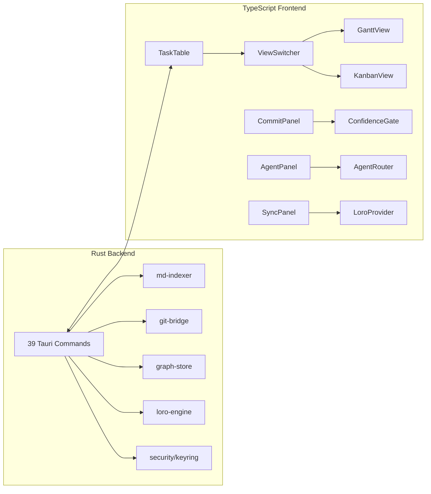

# Orqestra — v1.0.3 User-Ready Beta Specification

**Version:** 1.0.3  
**Date:** 2026-06-02  
**Status:** Draft — implementation-ready beta-readiness release  
**Release Theme:** User-Ready Beta  
**Base:** v1.0.2 tag at `8b9edd0`, after completion of Productization & Trust Hardening

---

## 1. Executive Summary

Orqestra v1.0.3 is a user-readiness release. It does not add a new architectural phase and it does not expand autonomy. It converts the v1.0.2 working, tested prototype into a product that an external reviewer can install, open, diagnose, and evaluate without reading the source tree.

The v1.0.2 baseline is strong: 27 commits, 90 source files, 13,462 lines of code, 39 Tauri commands, 7 AI service endpoints, 3 agent workspaces, 3 CI workflows, and 115 passing Rust tests. The desktop app, dashboard, OS-keychain credential path, bugfix-agent review flow, and partial native `gix` commit path all exist.

The remaining product problem is not architecture. It is adoption friction.

An external user still needs too much implicit knowledge:

- Which environment variables are required for real AI output.
- Which GitHub/Cloudflare secrets are required for deployment.
- What a valid Orqestra repository looks like.
- How to distinguish a missing setup step from a product failure.
- How to start with a safe sample project.
- How to collect diagnostics without leaking credentials.
- Which platform bundles are available and what limitations apply.

v1.0.3 closes that gap through six bounded workstreams:

1. First-run onboarding wizard.
2. Environment and secret readiness checks.
3. Project validation plus a generated sample project.
4. Cross-platform artifact completion and release labeling.
5. Diagnostics and error recovery panel.
6. External-reviewer documentation and demo path.

The guiding principle for this release is:

> **A reviewer should be able to evaluate Orqestra from a fresh install without source-code archaeology.**

---

## 2. Release Goals

### 2.1 Primary Goals

| Goal | Description | Outcome |
|---|---|---|
| First-run onboarding | Add a guided desktop flow for first launch, project selection, and setup status | New users understand what to do next inside the app |
| Environment readiness | Detect required local and remote setup inputs and show actionable statuses | Missing `ZAI_API_KEY`, Cloudflare secrets, Git, Python AI service, and dashboard deploy config are visible, not mysterious |
| Project validation | Validate selected folders before loading them as Orqestra projects | Invalid repos fail safely with actionable fixes |
| Sample project | Provide a built-in or generated sample Orqestra repo | External reviewers can test the product without preparing a real repo |
| Cross-platform release cleanup | Complete or clearly label Windows, macOS, and Linux bundles | Users download the correct artifact for their platform |
| Diagnostics and recovery | Add log/error bundle export with secret redaction | Support/debugging becomes repeatable without leaking credentials |

### 2.2 Secondary Goals

| Goal | Description | Outcome |
|---|---|---|
| Reviewer demo script | Create a deterministic demo path from install to dashboard/agent review | Demo quality no longer depends on oral explanation |
| README simplification | Move source-level details behind “developer setup”; foreground user install path | README becomes useful for external users and contributors |
| Failure-state UX | Replace generic errors with typed error screens and recovery actions | Common failures become self-explanatory |
| Release truthfulness | Preserve feature-state classification for public claims | README, release notes, and dashboard copy do not overclaim |

### 2.3 Non-Goals

The following remain out of scope for v1.0.3 unless they are strictly required to unblock onboarding or diagnostics:

- Full `gix` migration for every Git operation.
- Removing all remaining shell-outs.
- Full tree-sitter / AST-based code analysis.
- Dependency vulnerability scanning.
- Full ML-Master exploration loop.
- Real architect-agent implementation.
- Autonomous agent commits.
- Cloudflare Durable Object CRDT relay.
- Full edge worker semantic query API.
- Hosted SaaS, billing, marketplace, plugin store, or account system.
- Mandatory code signing / notarization. Signing is desirable, but unsigned artifacts may ship if clearly labeled.

---

## 3. Current Baseline

### 3.1 v1.0.2 Verified State

The v1.0.2 baseline includes:

- Repository: `github.com/Elephant-Rock-Lab/Orqestra`.
- Branch: `master`.
- HEAD: `8b9edd0`.
- Tags: `v1.0.0`, `v1.0.1`, `v1.0.2`.
- 27 total commits.
- 90 source files.
- 13,462 lines of code.
- 4 Rust crates: `md-indexer`, `git-bridge`, `graph-store`, `loro-engine`.
- 39 Tauri commands.
- 7 AI service endpoints.
- 3 agent workspaces: architect, bugfix, docs.
- 3 agent skills: debugging, documentation, testing.
- 3 CI workflows: dashboard deploy, desktop release, agent runners.
- 23 roadmap tasks: 17 done and 6 backlog.

### 3.2 Test and Build Baseline

Required v1.0.2 baseline to preserve:

| Layer | Current status |
|---|---|
| Rust tests | 115 total, all passing |
| HTTP endpoint tests | 7/7 passing |
| CDP UI tests | 10/10 passing |
| Desktop landing UI | `Open project folder` visible at `localhost:1420` |
| Windows binary | `target/release/orqestra-desktop.exe` |
| Windows installer | NSIS installer produced |
| Dashboard | `orqestra.pages.dev` returns 200 |
| Security module | keyring store + token masking |

### 3.3 Built Architecture

The v1.0.2 desktop architecture remains the foundation:



Capabilities already built:

- Markdown roadmap indexing through `md-indexer`.
- Task table, Gantt, Kanban, scheduler, and time tracking views.
- Semantic commits, backfill, graph store, reasoning traces, and query history.
- CRDT per-file documents with token-gated access and delta import/export.
- OS keychain credential path through `keyring-core`, with session fallback and token masking.
- Docs-agent and bugfix-agent review flows, both propose-only.
- Architect agent remains mock-mode.
- Dashboard reads roadmap JSON at runtime.

### 3.4 Known v1.0.2 Gaps That v1.0.3 Addresses

| Gap | v1.0.2 State | v1.0.3 Required State |
|---|---|---|
| First-run UX | Landing page only shows “Open project folder” | Guided onboarding with setup status and next actions |
| Setup clarity | Missing env/secrets produce confusing degraded behavior | Readiness dashboard explains exactly what is configured or missing |
| Project loading | User must know valid repo structure | Validator explains whether a folder is valid, repairable, or unsupported |
| Sample data | Reviewer needs a prepared repo | Built-in generated sample project available from onboarding |
| Diagnostics | Logs/tests exist but are developer-facing | User-facing diagnostic bundle export with redaction |
| Artifacts | Windows artifact exists; macOS/Linux bundling needs cleanup | Platform artifact status is explicit, tested, and documented |

### 3.5 Backlog That Remains Backlog

v1.0.3 must not disguise these as done:

| Task | State |
|---|---|
| TASK-060 — Full native `gix` migration | Partial; 9 `std::process::Command` calls remain |
| TASK-062 — AST-based code analysis | Not started |
| TASK-063 — Dependency vulnerability scanning | Not started |
| TASK-064 — Project-specific CI/CD integration | Partial |
| TASK-065 — ML-Master exploration loop | Stub |
| Edge worker / Durable Object relay | Not started |
| Architect agent | Mock-mode |

---

## 4. Architectural Positioning

v1.0.3 preserves the v0.5.1 through v1.0.2 architecture.

### 4.1 Tauri In-Process Boundary Remains Primary

The desktop renderer continues to call Rust through Tauri `invoke()` commands.

```text
React / TypeScript Renderer
  → Tauri invoke() commands
    → Tauri Rust command layer
      → Pure Rust core crates
```

The core crates must remain pure Rust libraries with zero Tauri dependencies:

- `md-indexer`
- `git-bridge`
- `graph-store`
- `loro-engine`

Tauri-specific onboarding, diagnostics, and native-dialog behavior belongs only under:

```text
apps/desktop/src-tauri/
```

### 4.2 AI Still Must Not Block Git

The semantic commit invariant remains unchanged:

```text
Git commit first
  → semantic stub immediately
    → AI backfill asynchronously
      → graph and embedding update later
```

v1.0.3 readiness checks may warn when the AI service or `ZAI_API_KEY` is missing, but standard Git and project-management operations must continue to function in degraded mode.

### 4.3 Onboarding Must Be Local-First

The onboarding wizard must not require account creation, hosted backend setup, or Cloudflare credentials to use local features.

Required modes:

| Mode | Requirements | Features available |
|---|---|---|
| Local PM only | Valid Orqestra repo or sample project | Roadmap, table, Gantt, Kanban, task edits |
| Local AI degraded | AI service missing or no `ZAI_API_KEY` | PM + mock/structured fallback where supported; clear degraded status |
| Local AI real | AI service running + valid `ZAI_API_KEY` | Docs/bugfix agents can invoke real AI service |
| Dashboard deployable | Cloudflare secrets configured in GitHub repo | Dashboard CI deploy path can work |
| Full contributor mode | Rust, Node, Python, Git available | Build, test, and development workflows |

---

## 5. Workstream A — First-Run Onboarding Wizard

### 5.1 Problem

The current app lands on a minimal `Open project folder` state. That is acceptable for an internal prototype, but not for a user-ready beta. A reviewer needs to understand what Orqestra is, what setup is optional, and how to load or create a valid test project.

### 5.2 Required UX Flow

On first launch, show an onboarding wizard with these steps:

```text
Welcome
  → Choose path
    → Validate project or create sample
      → Check environment readiness
        → Optional integrations
          → Open workspace
```

### 5.3 Step 1 — Welcome

Content requirements:

- One-sentence product definition.
- Clear statement that Orqestra works locally with a Git repository.
- Clear distinction between local features and optional AI/cloud features.
- Primary actions:
  - `Open existing project`
  - `Try sample project`
  - `View setup checklist`

Suggested copy:

```text
Orqestra turns a Git repository into a local-first project-management, semantic-history, and agent-assisted development workspace.

You can start with a sample project, open an existing Orqestra repository, or review setup checks for AI and dashboard deployment.
```

### 5.4 Step 2 — Choose Path

Options:

| Option | Behavior |
|---|---|
| Open existing project | Opens directory picker, then runs project validation |
| Try sample project | Creates or opens generated sample project under app data or chosen folder |
| Developer setup | Shows local dependency checks and build commands |

### 5.5 Step 3 — Validate Project

If the user selects a folder, the app must run `validate_project_cmd` before loading it.

Validation outputs:

| Status | Meaning | User action |
|---|---|---|
| `valid` | Folder is a loadable Orqestra repo | Continue |
| `repairable` | Folder is close but missing optional/recoverable files | Offer guided repair |
| `not_orqestra` | Folder lacks required roadmap structure | Offer sample project or initialization guide |
| `invalid` | Folder has malformed required files | Show errors and affected paths |
| `inaccessible` | Permissions/path issue | Explain path or permission failure |

### 5.6 Step 4 — Environment Readiness

Display readiness cards:

- Git installed.
- Roadmap valid.
- Tauri command layer reachable.
- AI service reachable.
- `ZAI_API_KEY` configured.
- GitHub credential stored.
- Cloudflare deployment secrets documented/configured.
- Dashboard JSON present/fresh.
- Platform artifact status.

Each card must include:

```typescript
interface ReadinessCard {
  id: string;
  label: string;
  status: 'ok' | 'warning' | 'missing' | 'error' | 'not_applicable';
  summary: string;
  details?: string;
  action?: {
    label: string;
    kind: 'open_url' | 'open_file' | 'run_check' | 'copy_command' | 'open_panel';
    payload?: string;
  };
}
```

### 5.7 Step 5 — Optional Integrations

The wizard must not block local use when optional integrations are missing.

Optional integrations:

| Integration | Required for | Missing behavior |
|---|---|---|
| `ZAI_API_KEY` | Real AI output | Show degraded AI status; allow local PM |
| Python AI service | Docs/bugfix agent real calls | Show start command and health check |
| GitHub credential | Push/pull and release workflows | Show credential panel |
| Cloudflare secrets | Dashboard auto-deploy | Show GitHub repository secrets checklist |

### 5.8 Step 6 — Open Workspace

After onboarding, open the main app shell with:

- Project root visible.
- Current readiness status accessible from a toolbar item.
- Diagnostic panel accessible from the same area.
- “Return to onboarding” action under Help/Setup.

### 5.9 Persistence

Store onboarding completion in local app config only:

```json
{
  "onboarding_completed": true,
  "last_project_root": "/path/to/project",
  "last_readiness_check": "2026-06-02T00:00:00Z"
}
```

Rules:

- Do not store secrets in onboarding state.
- Do not store raw tokens, PATs, API keys, or vault unlock data.
- Do not write onboarding state into the user’s repository unless explicitly requested.

### 5.10 Acceptance Criteria

- First launch shows onboarding, not just the project picker.
- User can open an existing valid Orqestra repo through the wizard.
- User can generate and open a sample project through the wizard.
- Missing AI/cloud setup does not block local PM use.
- Onboarding completion persists across app restart.
- User can reopen setup/readiness after onboarding.
- CDP test verifies onboarding renders and primary actions are available.

---

## 6. Workstream B — Environment and Secret Readiness Checks

### 6.1 Problem

The v1.0.2 report lists known blockers that are environmental rather than architectural: `ZAI_API_KEY` missing, Cloudflare secrets absent, macOS/Linux bundler targets incomplete, and several features intentionally degraded or mock-mode. These must become visible product states.

### 6.2 Readiness Command

Add a Tauri command:

```rust
get_readiness_cmd(project_root: Option<String>) -> Result<ReadinessReport, CommandError>
```

DTO:

```typescript
export interface ReadinessReport {
  generated_at: string;
  app: AppReadiness;
  project: ProjectReadiness | null;
  local_tools: ToolReadiness[];
  ai: AiReadiness;
  credentials: CredentialReadiness;
  dashboard: DashboardReadiness;
  release_artifacts: ReleaseArtifactReadiness[];
  warnings: ReadinessWarning[];
}

export interface AppReadiness {
  version: string;
  git_sha: string | null;
  tauri_commands_registered: number | null;
  platform: 'windows' | 'macos' | 'linux' | 'unknown';
}

export interface ToolReadiness {
  tool: 'git' | 'node' | 'rust' | 'python' | 'wrangler';
  status: 'found' | 'missing' | 'unknown';
  version?: string;
  required_for: string[];
}

export interface AiReadiness {
  service_status: 'reachable' | 'unreachable' | 'not_checked';
  health_url: string;
  api_key_status: 'configured' | 'missing' | 'unknown';
  mode: 'real' | 'degraded_mock' | 'unavailable';
  last_error?: string;
}

export interface CredentialReadiness {
  github_token: 'stored' | 'missing' | 'error' | 'not_checked';
  provider: 'keyring' | 'session' | 'none' | 'unknown';
  last_error?: string;
}

export interface DashboardReadiness {
  local_json: 'present' | 'missing' | 'stale' | 'invalid' | 'not_checked';
  live_url_status: 'ok' | 'unreachable' | 'not_checked';
  source_commit?: string;
  cloudflare_secrets: 'documented' | 'configured' | 'unknown';
}

export interface ReleaseArtifactReadiness {
  platform: 'windows' | 'macos' | 'linux';
  status: 'available' | 'missing' | 'not_checked';
  artifact_name?: string;
  limitation?: string;
}

export interface ReadinessWarning {
  code: string;
  severity: 'info' | 'warning' | 'error';
  message: string;
  recovery: string;
}
```

### 6.3 Local Tool Checks

Readiness checks must be fast and side-effect free.

Permitted local checks:

```bash
git --version
node --version
npm --version
rustc --version
cargo --version
python --version
uv --version
wrangler --version
```

Rules:

- Missing developer tools must not block normal installed-app usage.
- Developer tools should be grouped under “Contributor checks.”
- Git is required for Git sync; if missing, project-management views still work.

### 6.4 AI Readiness

The app must distinguish between these cases:

| Case | Meaning | UI status |
|---|---|---|
| AI service unreachable | `http://localhost:8000/health` fails | “AI service not running” |
| AI service reachable, key missing | `/health` works, `ZAI_API_KEY` absent or test endpoint returns auth-expected | “AI service available in degraded/mock mode” |
| AI service reachable, key valid | Health works and authenticated test succeeds | “Real AI enabled” |
| AI endpoint returns controlled fallback | Server intentionally returns structured mock | “Degraded fallback, not real AI” |

The UI must never label mock/fallback output as real AI.

### 6.5 Cloudflare Readiness

The desktop app cannot reliably read GitHub repository secrets directly unless a GitHub integration is configured. Therefore, Cloudflare readiness should distinguish:

| Status | Meaning |
|---|---|
| `documented` | App can show required secret names and setup instructions |
| `configured` | CI or GitHub API confirms secrets/config exist |
| `unknown` | App cannot verify remote secret state |

Required secret names:

```text
CLOUDFLARE_API_TOKEN
CLOUDFLARE_ACCOUNT_ID
```

The app must not ask the user to paste Cloudflare API tokens into general UI state. If credential capture is implemented, it must go through the same secret-storage boundary as GitHub credentials.

### 6.6 Security Rules

- Readiness DTOs must never include raw tokens, PATs, API keys, secrets, password fields, or unlock secrets.
- Any field name containing `token`, `pat`, `secret`, `password`, `key`, or `unlock` must be reviewed. Exceptions require explicit test coverage proving no raw secret value is serialized.
- Error messages must pass through token masking before being sent to the renderer.
- Logs included in readiness output must be summaries, not raw logs.

### 6.7 Tests

Add tests:

| Test | Requirement |
|---|---|
| `readiness_serializes_without_secret_fields` | DTO contains no forbidden raw secret fields |
| `ai_readiness_missing_key_is_degraded` | Missing `ZAI_API_KEY` is not shown as real AI |
| `tool_check_missing_is_warning` | Missing contributor tools do not block local PM |
| `credential_error_is_redacted` | Keyring errors are masked |
| `cloudflare_unknown_is_not_failure` | Unknown remote secret state does not fail local startup |

### 6.8 Acceptance Criteria

- Readiness panel exists after onboarding and in main app.
- Missing AI key is clearly shown as degraded mode.
- Missing Cloudflare secrets are shown as deployment-only blockers.
- Missing developer tools are shown as contributor-only blockers.
- No readiness DTO leaks raw secrets.
- Tests cover degraded and missing states.

---

## 7. Workstream C — Project Validation and Sample Project

### 7.1 Problem

A user can currently pick a folder, but the product must explain whether that folder is a valid Orqestra repository. It must also provide a known-good project for reviewers.

### 7.2 Project Validation Command

Add:

```rust
validate_project_cmd(project_root: String) -> Result<ProjectValidationResult, CommandError>
```

DTO:

```typescript
export interface ProjectValidationResult {
  project_root: string;
  status: 'valid' | 'repairable' | 'not_orqestra' | 'invalid' | 'inaccessible';
  detected: ProjectDetectedState;
  errors: ProjectValidationIssue[];
  warnings: ProjectValidationIssue[];
  suggested_actions: SuggestedAction[];
}

export interface ProjectDetectedState {
  is_git_repo: boolean;
  has_roadmap_dir: boolean;
  has_index_md: boolean;
  task_count: number;
  malformed_task_count: number;
  has_orqestra_dir: boolean;
  has_orqestra_toml: boolean;
  has_dashboard_json: boolean;
}

export interface ProjectValidationIssue {
  code: string;
  path?: string;
  message: string;
  severity: 'info' | 'warning' | 'error';
}

export interface SuggestedAction {
  id: string;
  label: string;
  description: string;
  kind: 'open_docs' | 'create_file' | 'open_sample' | 'initialize_project' | 'retry';
  safe: boolean;
}
```

### 7.3 Validation Rules

A folder is `valid` when:

- It is accessible.
- It contains `roadmap/`.
- It contains at least one valid `pm-task` file or a valid `_index.md` coordinator.
- Roadmap indexing returns tasks or non-fatal warnings.

A folder is `repairable` when:

- It is accessible.
- It is a Git repo or normal folder.
- It is missing optional files such as `.Orqestra/` or `Orqestra.toml`.
- It has a `roadmap/` directory but missing optional coordinator files.

A folder is `not_orqestra` when:

- It lacks `roadmap/` and Orqestra metadata.

A folder is `invalid` when:

- Required files exist but are malformed enough that indexing cannot proceed.
- Task IDs are duplicated.
- YAML frontmatter is malformed in required roadmap files.

A folder is `inaccessible` when:

- Permissions, path encoding, or filesystem errors prevent reading.

### 7.4 Guided Repair

v1.0.3 may offer safe repairs only:

| Repair | Allowed? | Notes |
|---|---:|---|
| Create `.Orqestra/` directory | Yes | Local metadata only |
| Create `.Orqestra/.gitignore` | Yes | Must use current rules |
| Create `Orqestra.toml` | Yes | Only after user confirms |
| Create `roadmap/` | Yes | Only in initialization flow |
| Modify existing task files automatically | No | Must be explicit editor action |
| Delete files | No | Not allowed in validator |

### 7.5 Sample Project

Add one of these implementations:

Preferred:

```text
examples/sample-orqestra-project/
```

Alternative:

```rust
create_sample_project_cmd(destination: Option<String>) -> Result<SampleProjectResult, CommandError>
```

Sample project must include:

```text
sample-orqestra-project/
├── README.md
├── Orqestra.toml
├── roadmap/
│   ├── _index.md
│   ├── TASK-2026-SAMPLE-001.md
│   ├── TASK-2026-SAMPLE-002.md
│   ├── TASK-2026-SAMPLE-003.md
│   └── ADR-001.md
├── src/
│   └── sample.ts
└── .Orqestra/
    └── .gitignore
```

Sample tasks should demonstrate:

- One backlog task.
- One in-progress task.
- One done task.
- One dependency edge.
- Labels that route to docs and bugfix agents.
- Safe file scope for bugfix demo.

### 7.6 Sample Project Rules

- The generated sample must not include real credentials.
- The generated sample must not require external network access.
- The sample project must pass `validate_project_cmd`.
- The sample project must render table, Gantt, and Kanban views.
- The docs-agent demo should work in fallback mode and real AI mode.
- The bugfix-agent demo must still require user-selected files.

### 7.7 Tests

Add tests:

| Test | Requirement |
|---|---|
| `validates_generated_sample_project` | Generated sample returns `valid` |
| `rejects_non_orqestra_folder` | Empty temp folder returns `not_orqestra` |
| `detects_malformed_task_frontmatter` | Malformed YAML returns `invalid` or warning as appropriate |
| `detects_duplicate_task_ids` | Duplicate IDs produce validation error |
| `repairable_missing_orqestra_toml` | Missing optional config is repairable, not fatal |

### 7.8 Acceptance Criteria

- Existing folder is validated before loading.
- Invalid folder errors are actionable.
- Sample project can be created/opened from onboarding.
- Sample project passes validation.
- Sample project renders PM views.
- Tests cover valid, repairable, not-Orqestra, invalid, and inaccessible classes where feasible.

---

## 8. Workstream D — Cross-Platform Artifact Completion and Labeling

### 8.1 Problem

v1.0.2 produced a Windows binary and NSIS installer. macOS/Linux bundling still requires cleanup. v1.0.3 must make platform support explicit: either produce artifacts or clearly label limitations.

### 8.2 Required Artifact Matrix

| Platform | Required artifact | Minimum v1.0.3 status |
|---|---|---|
| Windows x64 | `.exe` installer through NSIS | Required |
| macOS Apple Silicon | `.dmg` or `.app.tar.gz` | Required if CI runner succeeds; otherwise documented blocker |
| macOS Intel | Universal `.dmg` preferred; separate x64 acceptable | Required if CI runner succeeds; otherwise documented blocker |
| Linux x64 | `.AppImage` or `.deb` | Required if Tauri bundler dependencies are available; otherwise documented blocker |

### 8.3 macOS Universal Rule

If shipping a single macOS artifact, build universal:

```bash
rustup target add x86_64-apple-darwin aarch64-apple-darwin
npm run tauri build -w apps/desktop -- --target universal-apple-darwin
```

If universal packaging fails, ship two clearly labeled artifacts instead:

```text
Orqestra-macos-arm64.dmg
Orqestra-macos-x64.dmg
```

An unlabeled arm64-only macOS artifact does not satisfy the v1.0.3 release requirement.

### 8.4 Linux Bundler Rule

Linux release workflow must install required system packages for Tauri bundling. The workflow should attempt `.AppImage` first and `.deb` second.

If either artifact fails due to runner dependency limitations, the release notes must say exactly which Linux artifact is available or missing.

### 8.5 Artifact Metadata

Every release artifact must be accompanied by a manifest:

```json
{
  "version": "1.0.3",
  "git_sha": "<sha>",
  "built_at": "2026-06-02T00:00:00Z",
  "platform": "windows-x64",
  "artifact": "Orqestra_1.0.3_x64-setup.exe",
  "signed": false,
  "known_limitations": ["Unsigned beta artifact"]
}
```

Suggested file:

```text
release-artifacts.json
```

### 8.6 CI Workflow Requirements

Update or add:

```text
.github/workflows/desktop-release.yml
```

Required behavior:

- Trigger on tags `v*` and manual dispatch.
- Matrix builds Windows, macOS, Linux.
- Upload artifacts even when one platform fails, if other platforms succeed.
- Generate artifact manifest.
- Mark release as failed only if Windows artifact fails or if all platforms fail.
- Clearly label unsigned artifacts.

### 8.7 Acceptance Criteria

- Windows artifact remains available.
- macOS artifacts are either universal or explicitly split by architecture.
- Linux artifact exists or release notes document exact blocker.
- Artifact manifest is attached to release.
- README download table matches actual artifacts.
- Release notes do not imply unsupported platforms are fully supported.

---

## 9. Workstream E — Diagnostics and Error Recovery Panel

### 9.1 Problem

The codebase has tests, smoke scripts, logs, and security masking, but a user-facing beta needs a single place to inspect health and export diagnostics safely.

### 9.2 Diagnostics Panel

Add a main-app panel reachable from:

```text
Help → Diagnostics
```

or a visible toolbar button:

```text
Setup / Diagnostics
```

Panel sections:

1. App version and platform.
2. Current project validation summary.
3. Readiness report.
4. Recent command errors.
5. AI service status.
6. Credential provider status.
7. Dashboard/deployment status.
8. Export diagnostics button.

### 9.3 Diagnostic Bundle Command

Add:

```rust
export_diagnostics_cmd(project_root: Option<String>) -> Result<DiagnosticBundleResult, CommandError>
```

DTO:

```typescript
export interface DiagnosticBundleResult {
  path: string;
  created_at: string;
  files: DiagnosticBundleFile[];
  redaction_summary: RedactionSummary;
}

export interface DiagnosticBundleFile {
  name: string;
  description: string;
  bytes: number;
}

export interface RedactionSummary {
  rules_applied: string[];
  redacted_value_count: number;
  contains_raw_secrets: false;
}
```

### 9.4 Bundle Contents

Create a `.zip` or directory bundle containing:

```text
orqestra-diagnostics-<timestamp>/
├── app.json
├── readiness.json
├── project-validation.json
├── recent-errors.json
├── system.txt
├── ai-health.json
├── dashboard-status.json
└── README.txt
```

Optional developer-only files:

```text
rust-test-summary.txt
http-test-summary.txt
cdp-test-summary.txt
```

Do not include:

- Raw GitHub PATs.
- Raw API keys.
- Stronghold/keyring data.
- OS keychain records.
- Full environment dump.
- Full repository source.
- Full task content unless explicitly approved.
- `.Orqestra/agents/` local workspace state unless redacted and user-approved.

### 9.5 Redaction Rules

Apply existing token masking and extend it to diagnostics.

Patterns to redact:

```text
ZAI_API_KEY=...
CLOUDFLARE_API_TOKEN=...
CLOUDFLARE_ACCOUNT_ID=...        # account ID is less sensitive but should still be minimized
GITHUB_TOKEN=...
ghp_...
gho_...
ghu_...
ghs_...
ghr_...
sk-...
Bearer ...
token: ...
password: ...
secret: ...
```

Redaction output:

```text
[REDACTED:ZAI_API_KEY]
[REDACTED:GITHUB_TOKEN]
[REDACTED:BEARER_TOKEN]
```

### 9.6 Error Recovery Cards

Map common failures to recovery cards:

| Error code | User-facing recovery |
|---|---|
| `ROADMAP_NOT_FOUND` | “This folder does not contain `roadmap/`. Open a different folder or create a sample project.” |
| `PROJECT_INVALID_YAML` | “A roadmap file has malformed YAML. Open the file and fix the frontmatter.” |
| `AI_SERVICE_UNREACHABLE` | “Start the local AI service, then retry the health check.” |
| `AI_KEY_MISSING` | “Set `ZAI_API_KEY` to enable real AI output. Local PM still works.” |
| `GITHUB_TOKEN_MISSING` | “Save a GitHub token in Credentials before push/pull.” |
| `KEYRING_UNAVAILABLE` | “OS credential storage is unavailable. Secrets cannot be stored persistently on this system.” |
| `DASHBOARD_JSON_MISSING` | “Generate dashboard JSON before building or deploying the dashboard.” |
| `CLOUDFLARE_SECRETS_UNKNOWN` | “Add required Cloudflare secrets to GitHub Actions or deploy manually.” |

### 9.7 Tests

Add tests:

| Test | Requirement |
|---|---|
| `diagnostics_bundle_excludes_secrets` | Bundle contains no raw tokens/API keys |
| `diagnostics_redacts_known_patterns` | Redaction handles known prefixes and env syntax |
| `diagnostics_includes_readiness_report` | Bundle contains readiness summary |
| `recovery_cards_cover_known_error_codes` | Common command errors map to user-facing recovery |
| `export_diagnostics_handles_missing_project` | Diagnostics can export without loaded project |

### 9.8 Acceptance Criteria

- Diagnostics panel is reachable from main UI.
- Diagnostic export works with and without a loaded project.
- Bundle includes readiness and validation summaries.
- Bundle excludes raw secrets.
- Common errors show recovery cards.
- Redaction tests pass.

---

## 10. Workstream F — External Reviewer Documentation and Demo Path

### 10.1 Problem

The README and changelog are accurate for contributors, but v1.0.3 needs a reviewer-oriented path: install, open sample, verify PM views, check readiness, run a review-only agent, export diagnostics.

### 10.2 README Restructure

Top-level README should be reorganized:

1. What Orqestra is.
2. Download / install beta.
3. Try the sample project.
4. Open your own repository.
5. What works in v1.0.3.
6. What requires setup.
7. What remains backlog.
8. Developer setup.
9. Troubleshooting.

The developer setup should not be the first path unless the user is building from source.

### 10.3 New Documents

Add:

```text
docs/USER_GUIDE.md
docs/FIRST_RUN.md
docs/SETUP_CHECKS.md
docs/DIAGNOSTICS.md
docs/RELEASE_ARTIFACTS.md
docs/DEMO_SCRIPT_v1.0.3.md
```

### 10.4 Feature-State Table

Public docs must classify every major feature:

| Feature | State | Notes |
|---|---|---|
| Roadmap parsing | Implemented and verified | Local |
| Desktop PM views | Implemented and verified | Local |
| Dashboard | Implemented and deployed | Depends on generated JSON/deploy setup |
| OS keychain credentials | Implemented and verified | Platform behavior may vary |
| Docs agent | Implemented and review-only | Real AI requires `ZAI_API_KEY` |
| Bugfix agent | Implemented and review-only | User-selected files only |
| Architect agent | Mock-mode | Not production |
| ML-Master | Stub/backlog | Not production |
| Edge relay | Backlog | Not available |
| Full native Git | Partial | Some shell-outs remain |
| AST analysis | Backlog | Not available |

### 10.5 Demo Script

`docs/DEMO_SCRIPT_v1.0.3.md` must include a deterministic sequence:

1. Install or launch Orqestra.
2. Complete onboarding.
3. Create/open the sample project.
4. Show project validation success.
5. Show readiness panel.
6. Switch between Table, Gantt, and Kanban.
7. Open a task.
8. Run docs-agent or bugfix-agent in review-only mode.
9. Show proposed diff.
10. Reject once, then rerun and accept a safe Markdown-only change.
11. Show semantic stub/commit status if applicable.
12. Export diagnostics.
13. Open public dashboard or explain dashboard setup status.

### 10.6 Release Notes

Suggested release note:

```text
v1.0.3 turns Orqestra into a user-ready beta. It adds first-run onboarding, setup/readiness checks, project validation, a generated sample project, diagnostics export with secret redaction, and clearer cross-platform release artifact labeling. This release focuses on making the existing v1.0.2 functionality installable, explainable, and supportable for external reviewers. It does not add new autonomous agent behavior.
```

### 10.7 Acceptance Criteria

- README starts with user install/evaluation path, not source-build details.
- User guide explains local vs AI/cloud features.
- Demo script is executable by an external reviewer.
- Troubleshooting maps to diagnostics/recovery panel.
- Release notes do not overclaim architect agent, ML-Master, edge relay, AST analysis, or full native Git.

---

## 11. API and Command Additions

### 11.1 New Tauri Commands

| Command | Parameters | Returns | Purpose |
|---|---|---|---|
| `get_readiness_cmd` | `{ projectRoot?: string }` | `ReadinessReport` | Summarize environment, integrations, credentials, dashboard, artifact state |
| `validate_project_cmd` | `{ projectRoot: string }` | `ProjectValidationResult` | Classify selected folder before loading |
| `create_sample_project_cmd` | `{ destination?: string }` | `SampleProjectResult` | Create/open generated sample project |
| `get_onboarding_state_cmd` | `{}` | `OnboardingState` | Read first-run state |
| `set_onboarding_state_cmd` | `{ state: OnboardingStateUpdate }` | `OnboardingState` | Persist onboarding completion/preferences |
| `export_diagnostics_cmd` | `{ projectRoot?: string }` | `DiagnosticBundleResult` | Export redacted support bundle |
| `get_recovery_advice_cmd` | `{ code: string }` | `RecoveryAdvice` | Map error code to user-facing recovery action |

### 11.2 Command Error Contract

All new commands must return stable `CommandError` values:

```rust
#[derive(Debug, Serialize)]
pub struct CommandError {
    pub code: &'static str,
    pub message: String,
    pub recovery: Option<String>,
}
```

Rules:

- `code` must be stable and test-covered.
- `message` must be human-readable.
- `recovery` should be actionable when possible.
- Internal Rust enum variants must not leak directly to TypeScript.
- Raw secret values must be masked before serialization.

### 11.3 TypeScript Modules

Add or update:

```text
apps/desktop/src/onboarding/OnboardingWizard.tsx
apps/desktop/src/onboarding/WelcomeStep.tsx
apps/desktop/src/onboarding/ProjectStep.tsx
apps/desktop/src/onboarding/ReadinessStep.tsx
apps/desktop/src/onboarding/SampleProjectStep.tsx
apps/desktop/src/setup/ReadinessPanel.tsx
apps/desktop/src/setup/ReadinessCard.tsx
apps/desktop/src/setup/DiagnosticsPanel.tsx
apps/desktop/src/setup/RecoveryCard.tsx
apps/desktop/src/lib/readiness.ts
apps/desktop/src/lib/projectValidation.ts
apps/desktop/src/lib/diagnostics.ts
```

### 11.4 Rust Modules

Add or update:

```text
apps/desktop/src-tauri/src/commands/readiness.rs
apps/desktop/src-tauri/src/commands/project_validation.rs
apps/desktop/src-tauri/src/commands/onboarding.rs
apps/desktop/src-tauri/src/commands/diagnostics.rs
apps/desktop/src-tauri/src/diagnostics/redaction.rs
apps/desktop/src-tauri/src/diagnostics/bundle.rs
```

Register all commands in `main.rs` or the existing command module registry.

---

## 12. Testing Requirements

### 12.1 Existing Tests Must Remain Green

Required baseline:

```bash
cargo test --workspace
npm run build -w apps/desktop
npm run build -w apps/dashboard
```

Existing custom tests must remain green:

```bash
python .Orqestra/test_http_endpoints.py
python .Orqestra/test_cdp_ui.py
python .Orqestra/smoke_final.py
```

If smoke script has known false positive behavior, fix the script before using it as a release gate.

### 12.2 New Rust Tests

| Suite | Tests |
|---|---|
| `commands_readiness` | Missing AI key, AI unreachable, tool checks, DTO redaction |
| `commands_project_validation` | Valid sample, invalid YAML, duplicate task IDs, not-Orqestra folder |
| `commands_onboarding` | Read/write onboarding state, no secret persistence |
| `commands_diagnostics` | Bundle creation, redaction, no raw secrets, missing project case |
| `recovery_advice` | Known error codes map to recovery cards |

### 12.3 New UI Tests

CDP/Playwright tests:

| Test | Requirement |
|---|---|
| First-run renders onboarding | Wizard appears when onboarding state is unset |
| Sample project action visible | `Try sample project` is available |
| Project validation error shown | Invalid folder produces actionable UI |
| Readiness panel opens | Setup/readiness panel appears after onboarding |
| Diagnostics panel opens | Diagnostics panel visible and export action present |
| Main app still loads | Existing `Open project folder` flow remains available |

### 12.4 New Integration Smoke Test

Add:

```text
.Orqestra/smoke_user_ready_beta.py
```

Scenario:

1. Launch desktop dev app or packaged app.
2. Clear onboarding state.
3. Verify onboarding appears.
4. Create sample project.
5. Validate sample project.
6. Open sample project.
7. Verify Table/Gantt/Kanban render.
8. Run readiness check.
9. Export diagnostics.
10. Assert diagnostic bundle contains no known fake secret inserted by test.

### 12.5 Release Gates

v1.0.3 cannot be tagged unless:

- Existing 115 Rust tests still pass, or increased count passes.
- All new onboarding/readiness/diagnostics tests pass.
- HTTP endpoint tests pass.
- CDP UI tests pass.
- Sample project validates.
- Diagnostics redaction test passes.
- At least Windows artifact builds.
- README and release notes classify limitations truthfully.

---

## 13. CI/CD Requirements

### 13.1 Dashboard Workflow

Preserve the v1.0.2 dashboard workflow. v1.0.3 may add a check that confirms dashboard JSON source commit is present and readable.

Required steps:

```text
checkout
setup Rust
setup Node
cargo test -p md-indexer
npm ci
export roadmap JSON
npm run build -w apps/dashboard
upload dashboard artifact
deploy when Cloudflare credentials are available
```

### 13.2 Desktop Release Workflow

Update desktop release workflow to include:

- Artifact manifest generation.
- Platform-specific labels.
- macOS universal or split architecture rule.
- Linux artifact blocker reporting.
- Upload diagnostic note if a platform fails.

### 13.3 User-Ready Beta Workflow

Add or update:

```text
.github/workflows/user-ready-beta.yml
```

Suggested jobs:

```yaml
jobs:
  validate-sample-project:
    runs-on: ubuntu-latest
    steps:
      - checkout
      - setup rust/node
      - cargo test --workspace
      - run sample project validation command

  ui-onboarding-smoke:
    runs-on: ubuntu-latest
    steps:
      - checkout
      - setup node
      - npm ci
      - npm run build -w apps/desktop
      - run CDP/onboarding smoke test

  diagnostics-redaction:
    runs-on: ubuntu-latest
    steps:
      - checkout
      - cargo test -p orqestra-desktop diagnostics
```

The exact package names must match the repository implementation.

---

## 14. Documentation Updates

### 14.1 README

README must answer, in this order:

1. What is Orqestra?
2. How do I try it without source setup?
3. How do I open the sample project?
4. What works locally?
5. What requires AI setup?
6. What requires Cloudflare/GitHub setup?
7. How do I export diagnostics?
8. What is not done?
9. How do contributors build from source?

### 14.2 CHANGELOG

Add:

```markdown
## [1.0.3] - 2026-06-02

### Added
- First-run onboarding wizard
- Environment and integration readiness panel
- Project validation before workspace load
- Generated sample Orqestra project for reviewers
- Diagnostics panel and redacted diagnostic bundle export
- Error recovery cards for common setup failures
- Release artifact manifest and clearer platform labels
- User-ready beta demo script

### Changed
- README now foregrounds install/evaluation path before source-build path
- Missing AI/cloud setup is represented as degraded readiness, not generic failure
- Project loading now validates roadmap structure before opening the main workspace

### Security
- Diagnostics export redacts API keys, GitHub tokens, bearer tokens, and secret-like values
- Readiness DTOs are forbidden from exposing raw secret material
- Onboarding state excludes credentials and unlock data

### Known Limitations
- Architect agent remains mock-mode
- ML-Master exploration remains stub/backlog
- Full native gix migration remains incomplete
- AST/tree-sitter analysis remains backlog
- Edge relay / Durable Objects remain backlog
- Some artifacts may be unsigned beta builds
```

### 14.3 Release Notes

Release notes must include:

- A “How to try” section.
- A “What is real” section.
- A “What is degraded unless configured” section.
- A “Known limitations” section.
- Artifact table by platform.

---

## 15. Roadmap Task Updates

Create or update the following roadmap tasks.

### TASK-2026-076 — First-Run Onboarding Wizard

```yaml
---
pm-task: true
id: TASK-2026-076
title: "Add first-run onboarding wizard"
type: Task
status: backlog
priority: Critical
sprint: "Sprint 18"
epic: "User-Ready Beta"
assignee: "agent-desktop"
labels:
  - desktop
  - onboarding
  - beta
---
```

Acceptance criteria:

- First launch shows onboarding.
- User can open existing project or sample project.
- Wizard shows local vs optional AI/cloud setup.
- Completion state persists without storing secrets.

### TASK-2026-077 — Environment Readiness Panel

```yaml
---
pm-task: true
id: TASK-2026-077
title: "Add setup and environment readiness checks"
type: Task
status: backlog
priority: Critical
sprint: "Sprint 18"
epic: "User-Ready Beta"
assignee: "agent-desktop"
labels:
  - desktop
  - diagnostics
  - setup
---
```

Acceptance criteria:

- Readiness report distinguishes local, AI, credential, dashboard, and contributor checks.
- Missing `ZAI_API_KEY` is shown as degraded AI mode.
- Missing Cloudflare secrets are dashboard-deploy blockers only.
- Readiness DTOs do not expose raw secrets.

### TASK-2026-078 — Project Validation and Sample Project

```yaml
---
pm-task: true
id: TASK-2026-078
title: "Validate selected projects and provide sample project"
type: Task
status: backlog
priority: Critical
sprint: "Sprint 18"
epic: "User-Ready Beta"
assignee: "agent-architect"
labels:
  - md-indexer
  - onboarding
  - sample-project
---
```

Acceptance criteria:

- Selected folders are validated before load.
- Invalid folders show actionable errors.
- Sample project can be generated/opened from onboarding.
- Sample project passes validation and renders PM views.

### TASK-2026-079 — Diagnostics and Recovery Panel

```yaml
---
pm-task: true
id: TASK-2026-079
title: "Add diagnostics export and recovery guidance"
type: Task
status: backlog
priority: High
sprint: "Sprint 18"
epic: "User-Ready Beta"
assignee: "agent-security"
labels:
  - diagnostics
  - security
  - support
---
```

Acceptance criteria:

- Diagnostics panel is available from main UI.
- Diagnostic bundle exports readiness and validation summaries.
- Bundle redacts tokens/API keys/secrets.
- Common errors map to recovery cards.

### TASK-2026-080 — Cross-Platform Artifact Labeling

```yaml
---
pm-task: true
id: TASK-2026-080
title: "Complete and label beta release artifacts"
type: Task
status: backlog
priority: High
sprint: "Sprint 18"
epic: "User-Ready Beta"
assignee: "agent-devops"
labels:
  - release
  - desktop
  - ci
---
```

Acceptance criteria:

- Windows artifact remains available.
- macOS artifact is universal or architecture-labeled.
- Linux artifact is available or exact blocker is documented.
- Artifact manifest is attached to release.
- README artifact table matches release assets.

### TASK-2026-081 — External Reviewer Documentation

```yaml
---
pm-task: true
id: TASK-2026-081
title: "Write user-ready beta guide and demo script"
type: Task
status: backlog
priority: High
sprint: "Sprint 18"
epic: "User-Ready Beta"
assignee: "agent-docs"
labels:
  - docs
  - release
  - beta
---
```

Acceptance criteria:

- README foregrounds install/evaluation path.
- User guide explains local vs AI/cloud features.
- Demo script is deterministic.
- Feature-state table is truthful.
- Known limitations are explicit.

---

## 16. Release Checklist

### 16.1 Code

- [ ] Onboarding wizard implemented.
- [ ] Onboarding state persistence implemented.
- [ ] Project validation command implemented.
- [ ] Sample project generator or fixture implemented.
- [ ] Readiness command implemented.
- [ ] Readiness panel implemented.
- [ ] Diagnostics panel implemented.
- [ ] Diagnostic bundle export implemented.
- [ ] Recovery card mapping implemented.
- [ ] Artifact manifest generation implemented.
- [ ] README updated.
- [ ] CHANGELOG updated.
- [ ] User guide and demo script added.

### 16.2 Tests

- [ ] `cargo test --workspace`.
- [ ] `npm run build -w apps/desktop`.
- [ ] `npm run build -w apps/dashboard`.
- [ ] HTTP endpoint tests.
- [ ] CDP UI tests.
- [ ] Onboarding UI tests.
- [ ] Project validation tests.
- [ ] Sample project validation test.
- [ ] Diagnostics redaction tests.
- [ ] Artifact manifest test.

### 16.3 Release

- [ ] Create tag `v1.0.3`.
- [ ] Push tag.
- [ ] Confirm Windows artifact.
- [ ] Confirm macOS artifact or documented blocker.
- [ ] Confirm Linux artifact or documented blocker.
- [ ] Attach artifact manifest.
- [ ] Publish release notes.
- [ ] Verify README download table.
- [ ] Run demo script from a fresh clone or clean app profile.

---

## 17. Manual Smoke Test

Before tagging v1.0.3:

1. Install or launch packaged app.
2. Clear app profile/onboarding state.
3. Launch app.
4. Confirm onboarding appears.
5. Choose `Try sample project`.
6. Confirm sample project is created.
7. Confirm project validation returns `valid`.
8. Open sample project.
9. Confirm Table view renders tasks.
10. Confirm Gantt view renders dates/dependencies.
11. Confirm Kanban view renders status columns.
12. Open readiness panel.
13. Confirm missing optional integrations are warnings, not fatal errors.
14. Run AI health check with no `ZAI_API_KEY`; confirm degraded mode label.
15. Save GitHub credential if available; confirm keyring status only, no raw token.
16. Run docs-agent or bugfix-agent in review-only mode on sample-safe files.
17. Confirm diff review appears.
18. Reject the diff.
19. Export diagnostics.
20. Search diagnostic bundle for seeded fake secrets; confirm all are redacted.
21. Confirm README demo script matches observed behavior.

---

## 18. Success Definition

v1.0.3 is successful when an external reviewer can:

1. Download or launch Orqestra.
2. Complete onboarding without reading source code.
3. Open a generated sample project.
4. See valid roadmap tasks in Table, Gantt, and Kanban views.
5. Understand which setup items are complete, missing, degraded, or optional.
6. Run at least one review-only agent flow in a clearly labeled real or degraded mode.
7. Export a diagnostic bundle that contains no raw secrets.
8. Identify which release artifact applies to their platform.
9. Read the README and understand what is implemented, what is mock/degraded, and what remains backlog.

The release is not successful if:

- First launch still drops the user into an unexplained project picker.
- Missing AI/cloud configuration appears as unexplained failure.
- Invalid project folders produce raw parser errors without recovery guidance.
- Diagnostic export leaks secrets.
- README implies architect agent, ML-Master, edge relay, AST analysis, or full native Git are complete.
- Platform artifacts are mislabeled.

---

## 19. Post-v1.0.3 Backlog

After v1.0.3, continue in this recommended order:

1. Full native `gix` migration for remaining Git shell-outs.
2. AST/tree-sitter code analysis.
3. Dependency vulnerability scanning.
4. Real architect-agent execution.
5. ML-Master exploration loop.
6. Cloudflare edge worker and Durable Object CRDT relay.
7. Project-specific CI/CD integration.
8. Code signing and notarization.
9. Carefully gated autonomous commits for low-risk work.

---

## Appendix A — Suggested Branch Plan

```bash
git checkout master
git pull
git checkout -b beta/v1.0.3-user-ready
```

Suggested commit sequence:

```text
feat(onboarding): add first-run wizard and state persistence
feat(project): validate selected Orqestra repositories
feat(sample): generate reviewer sample project
feat(setup): add readiness checks and setup panel
feat(diagnostics): export redacted diagnostic bundles
build(release): add artifact manifest and platform labels
docs(beta): add user guide and v1.0.3 demo script
docs(release): document user-ready beta status
```

---

## Appendix B — Minimum Demo Script

A v1.0.3 demo should follow this order:

1. Launch clean app profile.
2. Show onboarding.
3. Create sample project.
4. Show project validation result.
5. Open Table, Gantt, Kanban.
6. Show readiness panel with at least one optional warning.
7. Run AI health check.
8. Run a review-only agent action.
9. Show diff review.
10. Export diagnostics.
11. Open diagnostic bundle and show redaction summary.
12. Open README feature-state table.
13. Show platform artifact table in release notes.

---

## Appendix C — Release Integrity Rule

Every public claim in README, release notes, dashboard copy, onboarding copy, and demo docs must be classified as one of:

```text
Implemented and verified
Implemented but local-only
Implemented but degraded without setup
Implemented but review-only
Implemented but mock-mode
Scaffolded but not wired
Backlog
```

No feature may be described as complete unless it has at least one of:

- Passing automated test.
- Working local demo.
- Successful deployment artifact.
- Successful packaged-app smoke test.

This rule is mandatory for v1.0.3 and should remain part of the release process afterward.
